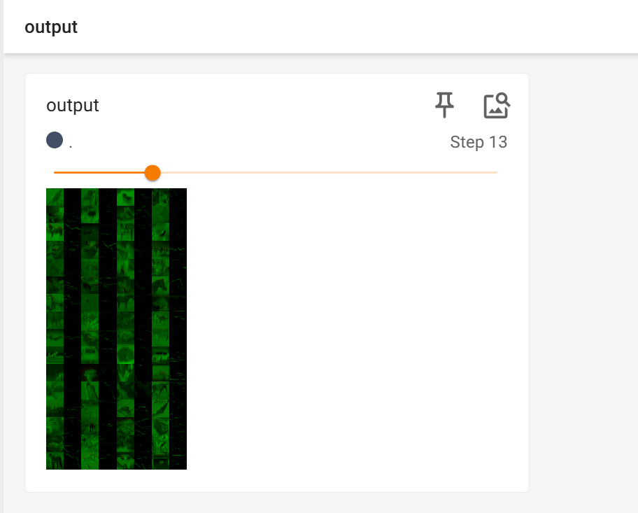
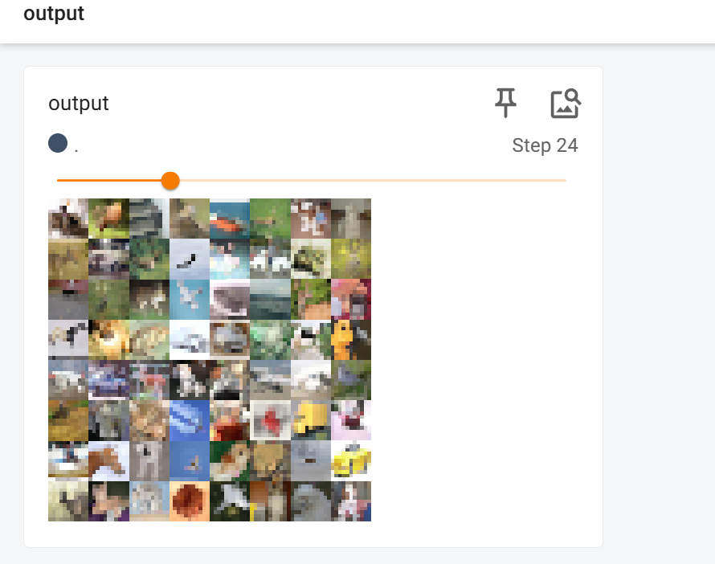

# Torch.nn
相关引用```from torch import  nn```

## nn.Module
`nn.Module` 是 PyTorch 框架中的一个基类，用于构建神经网络模型。它定义了神经网络的构建块，包括前向传播的方法 `forward` 和其他一些辅助方法。在 PyTorch 中，几乎所有的神经网络模型都是 `nn.Module` 的子类。

### 一些主要的属性和方法：

- `parameters()`: 返回模型的所有参数。
- `train()`: 将模型设置为训练模式。
- `eval()`: 将模型设置为评估模式。
- `forward(input)`: 定义模型的前向传播，需要用户自己实现。
- `state_dict()`: 返回一个包含模型所有参数和缓存的字典。
- `load_state_dict(state_dict)`: 从 `state_dict` 加载模型的参数和缓存。

创建自定义神经网络模型时，通常会继承 `nn.Module` 并实现以下两个方法：

1. `__init__(self)`: 构造函数，用于初始化模型的层和参数。
2. `forward(self, input)`: 定义模型的前向传播逻辑。

### 一个简单的自定义示例

```python
import torch
from torch import  nn

class OneNet(nn.Module):
    def __init__(self):
        super().__init__()

    def forward(self,input):
        output=input+2
        return output
onenet=OneNet()
x=torch.tensor([1,2,3])
output=onenet(x)
print(output)
```
在举例代码中，创建了一个简单的神经网络，主要包含了构造函数和模型的向前的传播逻辑

## nn.Conv2d
`nn.Conv2d` 是 PyTorch 中的一个模块，代表了一个二维卷积层，它是卷积神经网络（CNN）中的基本构建块。`nn.Conv2d` 通过学习输入数据的局部特征来提取特征，这些特征对于图像识别、分类和其他视觉任务非常重要。

### 参数：
- `in_channels`: 输入数据的通道数。例如，对于彩色图像，`in_channels` 通常是 3。
- `out_channels`: 输出数据的通道数，即卷积层的过滤器（或称为卷积核）数量。
- `kernel_size`: 卷积核的大小。可以是一个整数或一个元组 `(kH, kW)`，分别表示卷积核的高度和宽度。
- `stride`: 步长。控制卷积核滑动的间隔。可以是一个整数或一个元组 `(sH, sW)`。
- `padding`: 填充。用于在输入张量的边界周围添加零，以控制输出张量的大小。可以是整数或元组。
- `dilation`: 扩张率。控制卷积核中元素之间的间距。
- `groups`: 分组卷积的数量。允许并行应用过滤器。

### 操作：
`nn.Conv2d` 应用卷积操作，其基本步骤如下：
1. **填充（Padding）**：如果设置了 `padding`，会在输入张量的边界周围添加零。
2. **步长（Stride）**：根据 `stride` 参数，卷积核在输入张量上滑动。
3. **卷积操作**：卷积核在输入张量上滑动，计算局部区域的加权和，生成输出特征图（feature map）。

### 前向传播：
在前向传播中，`nn.Conv2d` 执行以下操作：
- 对于每个输出通道，使用对应的卷积核在输入张量上滑动并计算卷积。
- 所有输入通道的输出被求和，生成最终的输出特征图。

### 示例
```python
# 开发日期  2024/7/26
import torch
import torchvision
from torch import  nn
from torch.nn import Conv2d
from torch.utils.data import DataLoader
from torch.utils.tensorboard import SummaryWriter

dataset=torchvision.datasets.CIFAR10("./nn_data",train=False,download=True,transform=torchvision.transforms.ToTensor())
dataloader=DataLoader(dataset,batch_size=64)

class OneNet(nn.Module):
    def __init__(self):
        super(OneNet,self).__init__()
        self.conv=Conv2d(in_channels=3,out_channels=6,kernel_size=3,stride=1,padding=0)

    def forward(self,x):
        x=self.conv(x)
        return x

nn_conv=OneNet()

writer=SummaryWriter("nn_conv-logs")
step=0
for data in dataloader:
    imgs,tags=data
    writer.add_images("imgs",imgs,step)
    output=nn_conv(imgs)
    #torch.Size([64, 3, 32, 32])   imgs.shape
    #torch.Size([64, 6, 30, 30])    output.shape    考虑到tensoerboard的图像绘制，需要转化为三通道处理
    output=torch.reshape(output,(-1,3,30,30))
    writer.add_images("output",output,step)
    step=step+1

```
在上述的举例代码中，我们通过自定义的网络，实现了对输入的卷积操作，并通过CIFAR10数据集做测试，将卷积后的图像重构画出

再重构绘图时，要考虑到图像的三通道特性，通过reshape进行重构

### 图像卷积前后效果比对
**卷积前**


**卷积后**


卷积层是 CNN 中的关键组件，它们通过学习输入数据的局部模式来提取特征，这些特征随后可以被网络中的其他层进一步处理。

## nn.MaxPool2d
`nn.MaxPool2d` 是 PyTorch 中的一个模块，代表了一个二维的最大池化层（Max Pooling Layer），通常用于卷积神经网络（CNN）中降低特征图的空间维度，从而减少参数数量和计算量，同时使特征检测更加鲁棒。

### 参数：
- `kernel_size`: 池化窗口的大小。可以是一个整数或一个元组 `(kH, kW)`，分别表示高度和宽度。
- `stride`: 步长。控制池化窗口滑动的间隔。可以是一个整数或一个元组 `(sH, sW)`。如果不指定，默认值等于 `kernel_size`。
- `padding`: 填充。用于在输入特征图的边界周围添加零，以控制输出特征图的大小。可以是整数或元组。
- `dilation`: 扩张率。控制池化窗口中元素之间的间距。
- `ceil_mode`: 如果设置为 `True`，则使用 `ceil` 函数计算输出尺寸，否则使用 `floor` 函数。
- `return_indices`: 是否返回每个位置最大值的索引，用于某些特定的应用，如反池化（Unpooling）。

### 操作：
`nn.MaxPool2d` 应用最大池化操作，其基本步骤如下：
1. **定义池化窗口**：根据 `kernel_size` 定义池化窗口的大小。
2. **滑动窗口**：根据 `stride` 在输入特征图上滑动池化窗口。
3. **选择最大值**：在池化窗口覆盖的区域内，选择最大的元素值。

### 功能：
- **降维**：减少特征图的宽度和高度，从而降低后续层的计算负担。
- **特征不变性**：由于最大池化保留了区域内的最大响应，它增加了对小的位置变化的不变性。
- **防止过拟合**：减少特征图的尺寸有助于减少过拟合的风险。

### 示例代码：
```python
# 开发日期  2024/7/26
import torch
import torchvision
from torch import  nn
from torch.nn import MaxPool2d
from torch.utils.data import DataLoader
from torch.utils.tensorboard import SummaryWriter

input=torch.tensor([[1,2,0,3,1],
                    [0,1,2,3,1],
                    [1,2,1,0,0],
                    [5,2,3,1,1],
                    [2,1,0,1,1]])   #,dtype=torch.float32

input=torch.reshape(input,(-1,1,5,5))
print(input.shape)

class OneNet(nn.Module):
    def __init__(self):
        super(OneNet,self).__init__()
        self.maxpool=MaxPool2d(kernel_size=3,ceil_mode=True)

    def forward(self,input):
        output=self.maxpool(input)
        return output

nn_maxpool=OneNet()
writer=SummaryWriter("nn_maxpool-logs")
step=0

dataset=torchvision.datasets.CIFAR10("./nn_data",train=False,download=True,transform=torchvision.transforms.ToTensor())
dataloader=DataLoader(dataset,batch_size=64)

for data in dataloader:
    imgs,tags=data
    writer.add_images("imgs",imgs,step)
    output=nn_maxpool(imgs)
    writer.add_images("output",output,step)
    step=step+1

```
在这个示例中，我们定义了一个简单的网络实现池化操作，指定kernel_size大小为3,ceil_mode=True，并和上述对卷积层一样的操作，实现了对数据集的池化测试

ceil_mode如果为True则使用ceil函数，若为False则使用floor函数，两者本意为天花板与地板，表输出一大一之意，即表示当处理数据无法完全覆盖池化层时是否保留这部分输出。

### 图像池化前后效果对比
**池化前**


**池化后**



最大池化是一种常见的池化操作，它简单有效，能够显著降低特征图的维度，同时保留重要的特征信息。在实际应用中，最大池化经常与卷积层交替使用，以逐步提取和抽象特征。

## nn.ReLU&&nn.Sigmoid  非线性激活操作
### 激活函数
激活函数（Activation Function）是神经网络中的一种关键组件，用于在网络的每个神经元或每一层引入非线性。没有激活函数，无论神经网络有多少层，整个网络最终都只能表达线性关系，这大大限制了网络的表达能力。

#### 激活函数的主要作用包括：

1. **引入非线性**：激活函数使网络能够学习和执行更复杂的任务，因为非线性允许网络模拟非线性决策边界。

2. **帮助缓解梯度消失问题**：某些激活函数（如 ReLU 及其变体）有助于缓解或避免梯度消失问题，这在训练深层网络时尤为重要。

3. **控制神经元的激活**：激活函数决定了神经元是否应该被激活，即是否对最终的输出有贡献。

4. **影响网络的输出范围**：不同的激活函数会导致不同的输出范围，这可能会影响网络的学习和收敛速度。

#### 常见的激活函数类型：

- **线性激活函数**（例如恒等函数 `f(x) = x`）：它们不引入非线性，通常不用于隐藏层。
- **非线性激活函数**：
  - **Sigmoid**：将输入压缩到 0 和 1 之间，适用于二分类问题。
  - **Tanh**：将输入压缩到 -1 和 1 之间，比 Sigmoid 有更宽的输出范围。
  - **ReLU (Rectified Linear Unit)**：当前最流行的激活函数之一，特别是在隐藏层中，公式为 `f(x) = max(0, x)`。
  - **Leaky ReLU**：ReLU 的变体，允许负输入有一个非零的梯度。
  - **Parametric ReLU (PReLU)**：Leaky ReLU 的泛化形式，其斜率是可学习的参数。
  - **Exponential Linear Unit (ELU)**：改进的非线性激活函数，对负值的输入输出小于零的值。
  - **Scaled Exponential Linear Unit (SELU)**：自归一化激活函数，对于构建自归一化神经网络非常有用。
  - **Softmax**：将输入转换为概率分布，常用于多分类问题的输出层。
  - **Sigmoid 和 Tanh 的变体**：如 Softplus 和 SoftSign，提供平滑的输出。

### ReLu&&Sigmoid 
ReLU（Rectified Linear Unit）和 Sigmoid 是两种非常常见的激活函数，它们在神经网络中扮演着重要的角色，尤其是在不同的层和不同类型的问题中。

#### ReLU (Rectified Linear Unit)

**公式**：`f(x) = max(0, x)`
- ReLU 函数在输入为正数时直接输出该值，而在输入为负数时输出 0。

**特点**：
- **计算简单**：ReLU 的计算非常快速，因为它只涉及阈值操作。
- **空间效率**：由于其线性特性，ReLU 在正区间内不会增加额外的计算负担。
- **缓解梯度消失问题**：与 Sigmoid 或 Tanh 相比，ReLU 在正区间内具有恒定的梯度，这有助于缓解梯度消失问题，特别是在深层网络中。

**适用场景**：
- ReLU 通常用于隐藏层，因为它可以帮助网络学习非线性特征，同时保持计算效率。

**局限性**：
- **死亡 ReLU 问题**：在训练过程中，一些神经元可能会完全不激活（输出始终为 0），导致这些神经元的权重停止更新。

#### Sigmoid

**公式**：`f(x) = 1 / (1 + exp(-x))`
- Sigmoid 函数将输入压缩到 (0, 1) 区间内，输出可以解释为概率。

**特点**：
- **输出范围明确**：Sigmoid 的输出总是位于 0 和 1 之间，这使得它在二分类问题中特别有用。
- **平滑函数**：Sigmoid 是一个连续且可微的函数，这使得它在优化过程中表现良好。

**适用场景**：
- Sigmoid 通常用于二分类问题的输出层，因为它可以输出概率值。
- 在早期的神经网络中，Sigmoid 也常用于隐藏层，但现在通常被 ReLU 及其变体所取代。

**局限性**：
- **梯度消失问题**：当输入值非常大或非常小的时候，Sigmoid 函数的梯度接近于 0，这会导致梯度消失问题，影响深层网络的训练。
- **非零中心化输出**：Sigmoid 函数的输出不是以零为中心的，这可能会导致学习速度变慢。

### 举例
```python
# 开发日期  2024/7/26
import  torch
import torchvision
from torch import nn
from torch.nn import ReLU, Sigmoid
from torch.utils.data import DataLoader
from torch.utils.tensorboard import SummaryWriter

input=torch.tensor([[1,0.5],
                    [-1,3]])

input=torch.reshape(input,(-1,1,2,2))
print(input.shape)

class OneNet(nn.Module):
    def __init__(self):
        super(OneNet,self).__init__()
        self.relu=ReLU()
        self.sigmoid=Sigmoid()

    def forward(self,input):
        output=self.sigmoid(input)
        return output


nn_sigmoid=OneNet()
output=nn_sigmoid(input)
print(output)

dataset=torchvision.datasets.CIFAR10("./nn_data",train=False,download=True,transform=torchvision.transforms.ToTensor())
dataloader=DataLoader(dataset,batch_size=64)
step=1
writer=SummaryWriter("nn_sigmoid-logs")
for data in dataloader:
    imgs,tags=data
    writer.add_images("imgs",imgs,step)
    output=nn_sigmoid(imgs)
    writer.add_images("nn_relu",output,step)
    step=step+1
```

在上述代码中，我们定义了一个简单的网络可以实现非线性激活操作，并通过数据集测试非线性激活的效果，我们将图片在网络上实现了激活操作并构造画出

### 图像激活前后效果对比
**未变化前**


**变化后**

备注：虽然图像标题是ReLu，但是该图像是用Sigmoid函数作为激活函数的

## nn.Linear&&else
`nn.Linear` 是 PyTorch 中的一个模块，代表了一个全连接层（也称为线性层或稠密层），它是神经网络中的基本组件之一。全连接层的主要作用是将输入数据进行线性变换，然后可以添加一个非线性激活函数来引入非线性特性。

### 参数：
- `in_features`: 输入特征的数量，即输入数据的维度。
- `out_features`: 输出特征的数量，即输出数据的维度。

### 操作：
`nn.Linear` 层执行的是一个线性变换，其数学表达式为：output=input*weight+bias

其中：
- `weight` 是一个从 `in_features` 到 `out_features` 的矩阵。
- `bias` 是一个 `out_features` 维度的向量。

### 特点：
- `nn.Linear` 层创建权重矩阵和偏置向量，这些参数在训练过程中会被优化。
- 该层可以堆叠在卷积层、池化层或其他线性层之后，以实现特征的线性组合。

### 与激活函数的结合：
通常，全连接层后面会跟一个激活函数层，以引入非线性。例如，可以链式调用 `nn.ReLU()` 来在全连接层的输出上应用 ReLU 激活函数：

```python
# 创建一个包含全连接层和 ReLU 激活函数的模型
model = nn.Sequential(
    nn.Linear(1024, 512),
    nn.ReLU(),
    # 可以继续添加更多的层
)
```

### 示例
```python
# 开发日期  2024/7/26
import torch
import  torchvision
from torch import nn
from torch.nn import Linear
from torch.utils.data import DataLoader

dataset=torchvision.datasets.CIFAR10("./nn_data",train=False,download=True,transform=torchvision.transforms.ToTensor())
dataloader=DataLoader(dataset,batch_size=64,drop_last=True)

class OneNet(nn.Module):
    def __init__(self):
        super(OneNet,self).__init__()
        self.linear=Linear(196608,10)
    def forward(self,input):
        output=self.linear(input)
        return output

nn_linear=OneNet()


for data in dataloader:
    imgs,tags=data
    print(imgs.shape)  #torch.Size([64, 3, 32, 32])
   # output=torch.reshape(imgs,(1,1,1,-1)) 直接用flatten替代
    output=torch.flatten(imgs)
    print(output.shape)  #torch.Size([1, 1, 1, 196608])
    output=nn_linear(output)
    print(output.shape)        #torch.Size([1, 1, 1, 10])
'''
torch.Size([64, 3, 32, 32])
torch.Size([196608])
torch.Size([10])
'''
```
上述代码定义了一个简单的网络模型实现全连接的操作，并对数据集图片进行了该操作

全连接层是构建多层感知机（MLP）、深度神经网络和其他复杂模型的关键组件。通过组合多个全连接层和非线性激活函数，可以构建出能够学习和模拟复杂函数映射的模型。

## nn.Sequential&&An exampe
`nn.Sequential` 是 PyTorch 中的一个容器模块，用于包装一系列模块（可以是层或其它 `nn.Module` 的子类），并按顺序应用它们。使用 `nn.Sequential` 可以方便地构建一个神经网络，其中每个模块的输出自动成为下一个模块的输入。

### 特点：
- **简单性**：`nn.Sequential` 使得模型的构建变得简单直观，只需要按顺序添加层即可。
- **自动前向传播**：在 `nn.Sequential` 中定义的模块会按照它们添加到容器中的顺序自动进行前向传播。
- **无需显式定义 forward 函数**：由于 `nn.Sequential` 会自动处理数据的传递，因此不需要在子类中显式定义 `forward` 函数。

### 使用方法：
可以使用 `add_module` 方法或直接初始化时传入有序字典来添加模块。

#### 初始化时添加模块：
```python
import torch.nn as nn

model = nn.Sequential(
    nn.Conv2d(1, 20, 5),  # 第一个卷积层
    nn.ReLU(),             # ReLU 激活函数
    nn.Conv2d(20, 64, 5), # 第二个卷积层
    nn.ReLU()              # 第二个 ReLU 激活函数
)
```

#### 使用 add_module 添加模块：
```python
model = nn.Sequential()
model.add_module('conv1', nn.Conv2d(1, 20, 5))
model.add_module('relu1', nn.ReLU())
model.add_module('conv2', nn.Conv2d(20, 64, 5))
model.add_module('relu2', nn.ReLU())
```
### 注意事项：
- `nn.Sequential` 只处理前向传播，如果你需要处理复杂的模型逻辑，比如残差连接或者自定义的训练循环，可能需要使用更灵活的 `nn.Module` 子类。
- 所有模块都必须有参数，即它们必须是 `nn.Module` 的子类。
- `nn.Sequential` 中的模块按添加顺序执行，如果需要改变执行顺序，需要重新组织模块的添加顺序或使用更复杂的模型结构。

`nn.Sequential` 是快速搭建原型和简单模型的有用工具，它让模型构建变得快速且代码更简洁。

### 示例：
```python
# 开发日期  2024/7/27
import torch
from torch import nn
from torch.nn import Conv2d, MaxPool2d, Flatten, Linear, Sequential
from torch.utils.tensorboard import SummaryWriter


class OneNet(nn.Module):
    def __init__(self):
        super(OneNet,self).__init__()
        '''
        self.conv1=Conv2d(3,32,5,padding=2)
        self.maxpool1=MaxPool2d(2)
        self.conv2=Conv2d(32,32,5,padding=2)
        self.maxpool2=MaxPool2d(2)
        self.conv3=Conv2d(32,64,5,padding=2)
        self.maxpool3=MaxPool2d(2)
        self.flatten=Flatten()
        self.linear1=Linear(1024,64)
        self.linear2=Linear(64,10)
        '''
        self.model1=Sequential(
            Conv2d(3, 32, 5, padding=2),
            MaxPool2d(2),
            Conv2d(32, 32, 5, padding=2),
            MaxPool2d(2),
            Conv2d(32, 64, 5, padding=2),
            MaxPool2d(2),
            Flatten(),
            Linear(1024, 64),
            Linear(64, 10)
        )

    def forward(self,x):
        '''
        x=self.conv1(x)
        x=self.maxpool1(x)
        x=self.conv2(x)
        x=self.maxpool2(x)
        x=self.conv3(x)
        x=self.maxpool3(x)
        x=self.flatten(x)
        x=self.linear1(x)
        x=self.linear2(x)
        '''
        x=self.model1(x)
        return x


nn_practice=OneNet()
print(nn_practice)
input=torch.ones(64,3,32,32)
output=nn_practice(input)
print(output)
print(output.shape)

writer=SummaryWriter("nn_practice-logs")
writer.add_graph(nn_practice,input)
writer.close()
```
在上述代码中，我们通过Sequential定义了一个网络的完整操作，同时我们还可以通过tensorboard查看网络图

### 网络图展示

### 值得注意
网络中有些层的参数是通过实际计算出来的，这需要参考计算公式

推荐官方文档：

[Conv2d](https://pytorch.org/docs/stable/generated/torch.nn.Conv2d.html#torch.nn.Conv2d)
[MaxPool2d](https://pytorch.org/docs/stable/generated/torch.nn.MaxPool2d.html#torch.nn.MaxPool2d)

## nn.loss&&backward
损失函数（Loss Function）和反向传播（Backpropagation）是神经网络训练过程中的两个关键概念。

### 损失函数
损失函数衡量的是模型预测值与真实值之间的差异。损失越小，表示模型的预测越接近真实值。不同类型的问题会使用不同的损失函数：

- **回归问题**：通常使用均方误差（Mean Squared Error, MSE）或均方根误差（Root Mean Squared Error, RMSE）作为损失函数。
- **二分类问题**：可以使用二元交叉熵损失（Binary Cross-Entropy, BCE）。
- **多分类问题**：可以使用分类交叉熵损失（Categorical Cross-Entropy, CCE）。
- **目标检测或分割问题**：可能使用 IoU（Intersection over Union）损失或其他特定损失。

在 PyTorch 中，损失函数可以通过 `torch.nn` 模块中的不同类来实现，例如 `nn.MSELoss()` 或 `nn.CrossEntropyLoss()`。

### 反向传播
反向传播是一种在神经网络中计算损失函数关于网络参数的梯度的方法。这个过程是训练神经网络的核心，它遵循以下步骤：

1. **前向传播**：数据通过网络进行前向传播，得到预测输出，并计算损失函数值。

2. **计算梯度**：通过损失函数关于输出的导数，使用链式法则递归地计算每个参数的梯度。这一步是自动微分的核心，PyTorch 通过 `.grad` 属性自动为每个参数维护梯度。

3. **梯度清零**：在每次迭代开始前，需要清零之前积累的梯度，以避免梯度累加。

4. **参数更新**：使用优化器（如 SGD、Adam 等）根据计算出的梯度更新网络参数。

在 PyTorch 中，反向传播通过调用 `loss.backward()` 来实现，这会计算损失相对于网络参数的梯度。然后，可以通过优化器的 `.step()` 方法来更新参数。

### 示例
```python
# 开发日期  2024/7/27
import torch
import torchvision
from torch.nn import L1Loss, MSELoss, Sequential, Conv2d, MaxPool2d, Flatten, Linear
from torch import  nn
from torch.utils.data import DataLoader

inputs=torch.tensor([1,2,3],dtype=torch.float32)
outputs=torch.tensor([1,2,5],dtype=torch.float32)

x=torch.tensor([0.1,0.2,.3])
y=torch.tensor([1])
x=torch.reshape(x,(1,3))

inputs=torch.reshape(inputs,(1,1,1,3))
print(inputs)
outputs=torch.reshape(outputs,(1,1,1,3))
print(outputs)

loss=L1Loss(reduction='sum')
result=loss(inputs,outputs)

loss_mse=MSELoss()
result_mse=loss_mse(inputs,outputs)

loss_cross=nn.CrossEntropyLoss()
result_cross=loss_cross(x,y)

print(result)
print(result_mse)
print(result_cross)

dataset=torchvision.datasets.CIFAR10("./nn_data",train=False,download=True,transform=torchvision.transforms.ToTensor())
dataloader=DataLoader(dataset,batch_size=1,drop_last=True)

class OneNet(nn.Module):
    def __init__(self):
        super(OneNet,self).__init__()
        '''
        self.conv1=Conv2d(3,32,5,padding=2)
        self.maxpool1=MaxPool2d(2)
        self.conv2=Conv2d(32,32,5,padding=2)
        self.maxpool2=MaxPool2d(2)
        self.conv3=Conv2d(32,64,5,padding=2)
        self.maxpool3=MaxPool2d(2)
        self.flatten=Flatten()
        self.linear1=Linear(1024,64)
        self.linear2=Linear(64,10)
        '''
        self.model1=Sequential(
            Conv2d(3, 32, 5, padding=2),
            MaxPool2d(2),
            Conv2d(32, 32, 5, padding=2),
            MaxPool2d(2),
            Conv2d(32, 64, 5, padding=2),
            MaxPool2d(2),
            Flatten(),
            Linear(1024, 64),
            Linear(64, 10)
        )

    def forward(self,x):
        '''
        x=self.conv1(x)
        x=self.maxpool1(x)
        x=self.conv2(x)
        x=self.maxpool2(x)
        x=self.conv3(x)
        x=self.maxpool3(x)
        x=self.flatten(x)
        x=self.linear1(x)
        x=self.linear2(x)
        '''
        x=self.model1(x)
        return x

nn_loss=OneNet()
loss_cross=nn.CrossEntropyLoss()
for data in dataloader:
    imgs,tags=data
    print(imgs.shape)
    print(tags.shape)
    outputs=nn_loss(imgs)
    result_cross=loss_cross(outputs,tags)
    result_cross.backward()  #通过调试可以发现确实计算出了梯度
    print(result_cross)
```

上述代码先通过几个简单的例子认识了均方误差和二元交叉熵损失，然后定义了一个简单的网络，用CIFAR10计算损失函数，做简单的检验

同时还实现了反向传播，但是这个在实际运行结果上没有显示，通过调试打开后在grad处可以看到计算出的梯度

## 优化器
`torch.optim` 提供了一系列优化算法，用于神经网络的参数更新。这些优化算法通过调整网络的权重来最小化损失函数，从而训练模型。

### 常用优化器：

1. **SGD (Stochastic Gradient Descent)** - `optim.SGD`:
   - 随机梯度下降是最基础的优化算法，适用于各种优化问题。

2. **Adam** - `optim.Adam`:
   - Adam 是一个自适应学习率的优化算法，它结合了 RMSprop 和 Momentum 的优点，通常在实践中表现良好。

3. **RMSprop** - `optim.RMSprop`:
   - RMSprop 是一个自适应学习率的优化算法，适用于非平稳目标优化。

4. **ASGD (Averaged Stochastic Gradient Descent)** - `optim.ASGD`:
   - ASGD 在每次迭代中对梯度进行平均，以获得更稳定的学习率。

5. **Adadelta** - `optim.Adadelta`:
   - Adadelta 是一个自适应学习率的优化算法，它调整参数的更新幅度。

6. **Adagrad** - `optim.Adagrad`:
   - Adagrad 通过为每个参数调整学习率来优化稀疏数据。

7. **Momentum** - `optim.Momentum`:
   - 动量优化算法通过在参数更新中加入先前梯度的加权平均来加速 SGD。

8. **Nesterov Accelerated Gradient (NAG)** - `optim.NAG`:
   - NAG 是 Momentum 的一个变体，它修改了动量项的计算方式，以提供更好的性能。

9. **Adamax** - `optim.Adamax`:
   - Adamax 是 Adam 的一个变体，它使用不同的调整学习率的方法，适用于处理非常大的数据集。

### 使用优化器的步骤：

1. **创建优化器实例**：根据需要选择一个优化算法，并提供模型的参数作为参数。

   ```python
   optimizer = optim.SGD(model.parameters(), lr=0.01)
   ```

2. **前向传播**：计算模型的输出和损失。

3. **清零梯度**：在每次迭代开始前，需要清零模型参数的梯度。

   ```python
   optimizer.zero_grad()
   ```

4. **反向传播**：计算损失相对于模型参数的梯度。

   ```python
   loss.backward()
   ```

5. **参数更新**：使用优化器更新模型的参数。

   ```python
   optimizer.step()
   ```
### 值得注意
在一个优化器代码中，通常会有很多参数，但这取决于所选择的优化器的类别。

常见的最基础的是：`model.parameters()`和`lr`，除此之外，不同优化器还有一些独特的参数，超参数，这需要查阅相关资料和阅读官方文档

### 示例
```python
# 开发日期  2024/7/28
import torch
import torchvision
from torch.nn import L1Loss, MSELoss, Sequential, Conv2d, MaxPool2d, Flatten, Linear
from torch import nn
from torch.utils.data import DataLoader


dataset = torchvision.datasets.CIFAR10("./nn_data", train=False, download=True,
                                       transform=torchvision.transforms.ToTensor())
dataloader = DataLoader(dataset, batch_size=1, drop_last=True)


class OneNet(nn.Module):
    def __init__(self):
        super(OneNet, self).__init__()
        '''
        self.conv1=Conv2d(3,32,5,padding=2)
        self.maxpool1=MaxPool2d(2)
        self.conv2=Conv2d(32,32,5,padding=2)
        self.maxpool2=MaxPool2d(2)
        self.conv3=Conv2d(32,64,5,padding=2)
        self.maxpool3=MaxPool2d(2)
        self.flatten=Flatten()
        self.linear1=Linear(1024,64)
        self.linear2=Linear(64,10)
        '''
        self.model1 = Sequential(
            Conv2d(3, 32, 5, padding=2),
            MaxPool2d(2),
            Conv2d(32, 32, 5, padding=2),
            MaxPool2d(2),
            Conv2d(32, 64, 5, padding=2),
            MaxPool2d(2),
            Flatten(),
            Linear(1024, 64),
            Linear(64, 10)
        )

    def forward(self, x):
        '''
        x=self.conv1(x)
        x=self.maxpool1(x)
        x=self.conv2(x)
        x=self.maxpool2(x)
        x=self.conv3(x)
        x=self.maxpool3(x)
        x=self.flatten(x)
        x=self.linear1(x)
        x=self.linear2(x)
        '''
        x = self.model1(x)
        return x


nn_loss = OneNet()
loss_cross = nn.CrossEntropyLoss()
optim=torch.optim.SGD(nn_loss.parameters(),lr=0.01)

for epoch in range(20):
    running_loss=0.0
    for data in dataloader:
        imgs, tags = data
        outputs = nn_loss(imgs)
        result_cross = loss_cross(outputs, tags)
        optim.zero_grad()
        result_cross.backward()
        optim.step()
        running_loss=running_loss+result_cross

    print(running_loss)
```
在上述代码中，首先定义了一个处理CIFAR10的简单网络，定义了交叉熵作为损失函数，定义了随机梯度下降的优化器，并制定了学习率。对dataloader进行epoch轮(20次)学习,输出损失值的变化


