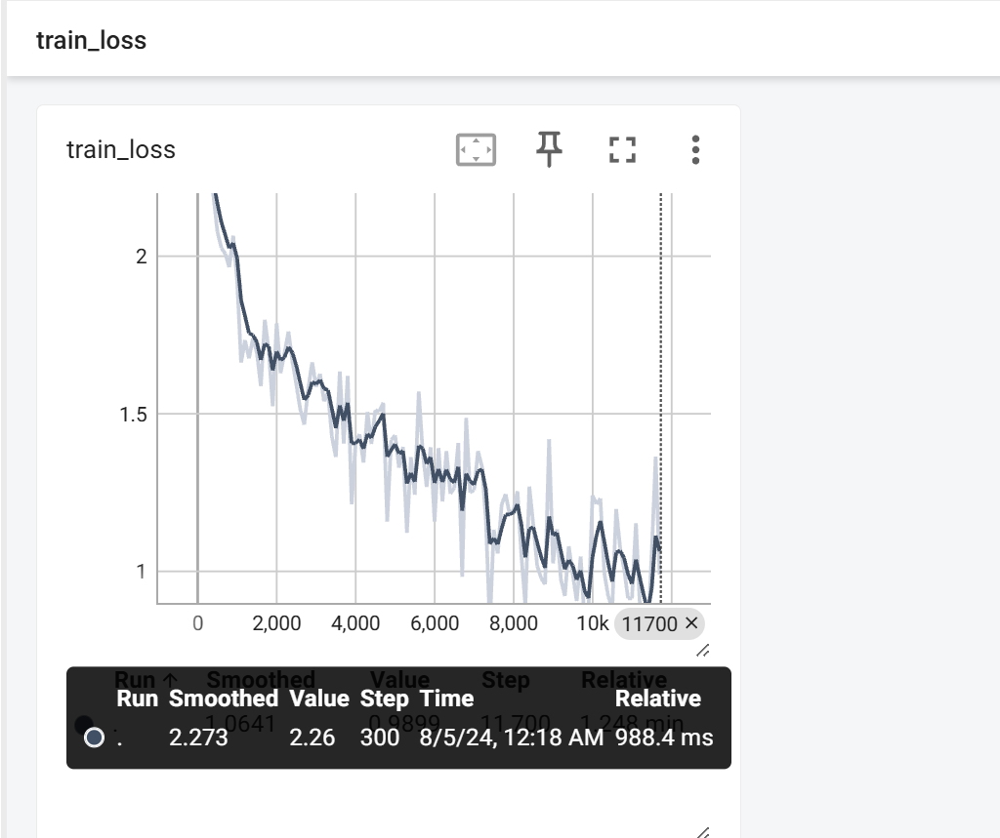
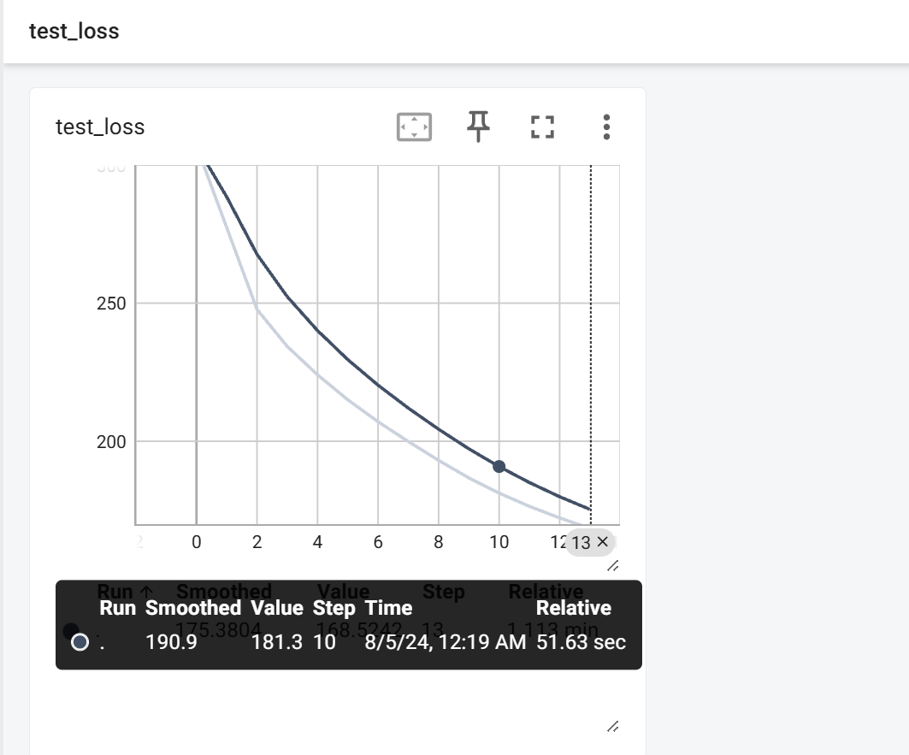
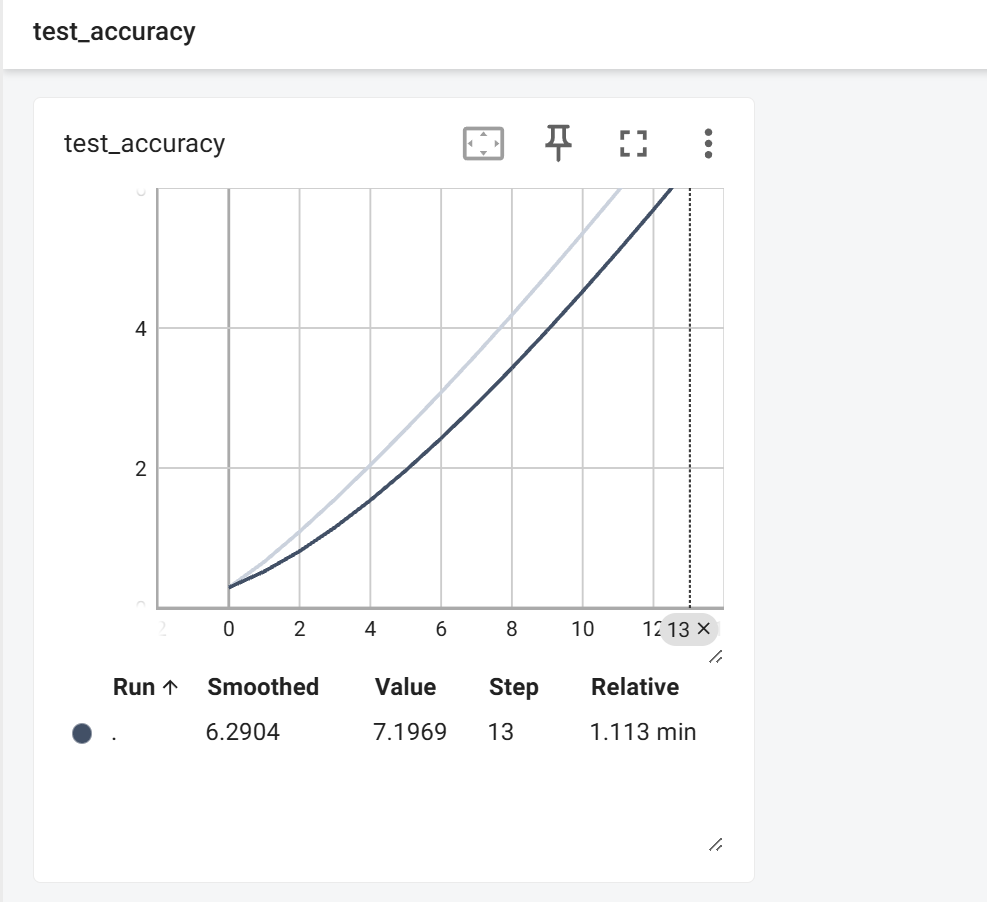

# Complete Process&&GPU Acceleration
在讲述训练流程之前，要先对GPU加速做出说明，以便后续更好展开叙述
## GPU加速
GPU加速通常有两种方法，一种是直接使用cuda指令，另一种是通过定义设备后将计算转移到该设备上进行计算
### 1.对象.cuda()
**转移模型**
```pyhton
mynet=MyNet()
if torch.cuda.is_available():
    mynet=mynet.cuda()
```
**转移损失函数**
```python
loss_fn=nn.CrossEntropyLoss()
if torch.cuda.is_available():
    loss_fn=loss_fn.cuda()
```
**转移训练数据**
```python
    for data in train_dataloader:
        imgs,tags=data
        if torch.cuda.is_available():
            imgs=imgs.cuda()
            tags=tags.cuda()
        output=mynet(imgs)
        loss=loss_fn(output,tags)
```
**转移测试数据**
```python
total_test_loss=0
    with torch.no_grad():
        for data in test_dataloader:
            imgs,tags=data
            if torch.cuda.is_available():
                imgs = imgs.cuda()
                tags = tags.cuda()
            output=mynet(imgs)
            loss=loss_fn(output,tags)
            total_test_loss=total_test_loss+loss.item()
            accuracy=(output.argmax(1)==tags).sum()
            total_accuracy=accuracy+total_accuracy
```
上述加速方法是通过对象.cuda()实现的，但是最好加入判断`if torch.cuda.is_available():`以便适应更多设备，使得即使没有GPU的计算机也不报错

## 2.定义设备&&用to指定设备
**定义设备**
```pyhton
#定义训练的设备
device=torch.device("cuda"if torch.cuda.is_available() else "cpu")
# device=torch.device("cuda")
```
上述未备注的代码是一种更加全面的表述方式，具有更强的设备适应性。

**通过to指定到设备**
```python
mynet=MyNet()
if torch.cuda.is_available():
    mynet.to(device)

loss_fn=nn.CrossEntropyLoss()
if torch.cuda.is_available():
    loss_fn.to(device)

if torch.cuda.is_available():   #同时包括训练集和测试集
    imgs=imgs.to(device)
    tags=tags.to(device)
```
当定义设备采用了`device=torch.device("cuda"if torch.cuda.is_available() else "cpu")`后就不需要在代码中进行判断了，判断已经被集成在初始的定义中了

## 完整的训练流程
以下举出的例子是对CIFAR10数据集的训练过程，包含轮内检测和tensorboard对训练参数的可视化

同时以下举例中使用的GPU加速方式默认的是定义设备的加速方式

### 1.准备数据集&&定义设备
```python
#1.准备数据集
train_data=torchvision.datasets.CIFAR10("../The complete process&&GPU acceleration/data",train=True,transform=torchvision.transforms.ToTensor(),download=True)
test_data=torchvision.datasets.CIFAR10("../The complete process&&GPU acceleration/data",train=False,transform=torchvision.transforms.ToTensor(),download=True)

#定义训练的设备
device=torch.device("cuda"if torch.cuda.is_available() else "cpu")
# device=torch.device("cuda")
```
我们获取了官方关于torchvision的数据集CIFAR10，注意获取的代码片段，在参数中我们定义了数据集的存放位置，区分了训练集和测试集，定义了数据格式，并通过download确定了下载

从官方获取数据集时，不同的数据集可能会有不同的相关参数，需要查阅资料和文档

我们选择了更全面的设备定义方式，这可以避免在代码中进行判断

**我们还可以在获取数据时加入一些检验，包括对数据集长度的检验**
```python
#可以检验一下数据集的长度
train_data_size=len(train_data)
print("训练数据集的长度为：{}".format(train_data_size))
test_data_size=len(test_data)
print("测试数据集的长度为：{}".format(test_data_size))
```

### 2.dataloader加载数据集
```python
#2.使用dataloader来加载数据集
train_dataloader=DataLoader(train_data,batch_size=64,drop_last=True)
test_dataloader=DataLoader(test_data,batch_size=64,drop_last=True)
```
上述参数只包括了批数量和drop_last，设置为True可以将最后数量不足的批舍去，防止代码报错

定义dataloader的参数还有很多，对于不同的数据集要给出不同的参数，有的可以默认，这需要查阅资料

### 3.搭建神经网络
```python
#3.搭建神经网络
class MyNet(nn.Module):
    def __init__(self):
        super(MyNet,self).__init__()
        self.model=nn.Sequential(
            nn.Conv2d(3,32,5,1,2),
            nn.MaxPool2d(2),
            nn.Conv2d(32,32,5,1,2),
            nn.MaxPool2d(2),
            nn.Conv2d(32,64,5,1,2),
            nn.MaxPool2d(2),
            nn.Flatten(),
            nn.Linear(64*4*4,64),
            nn.Linear(64,10)
        )

    def forward(self,x):
        x=self.model(x)
        return x
```
上述代码定义了一个处理CIFAR10数据集的网络，通过Sequential集成，便于后续对网络的检查，维护和修改

**网络也可以单独定义在一个文件中，比如定义在model.py中**，这时在代码头部要通过语句`from model import *`表示引用这个文件中的所有内容

### 4.创建模型实例
```python
#4.创建网络模型
mynet=MyNet()
```

### 5.定义损失函数与优化器
```python
#5.损失函数与优化器
loss_fn=nn.CrossEntropyLoss()

learning_rate=1e-2
optimizer=torch.optim.SGD(mynet.parameters(),lr=learning_rate)
```
上述代码将交叉熵损失值作为了损失函数，选择随机梯度下降为优化器，学习率0.01

不同的优化器可能会对应不同的参数，但学习率和模型.parameters()基本上是必须有的，其余的需要查阅资料

### 6.设置训练相关参数
```python
#6.设置相关训练参数
total_train_step=0
total_test_step=0
total_accuracy=0
epoch=30
```
定义了包括训练轮数和训练步数，以及一些损失值和准确率，方便随日志记录模型训练过程和实现可视化

### 7.添加tensorboard(可选)
```python
#7.添加tensorboard
writer=SummaryWriter("../The complete process&&GPU acceleration/mynet-logs")
```
注意存放位置，最好在整个模型所在的文件夹下

### 8.训练并伴随轮次测试
**开始计时**
```python
start_time=time.time()
```
加入计时器方便查看训练所需时间方便做出调整

**开始训练，并在每一轮训练结束后通过测试集测试，将训练测试时损失函数变化可视化，将测试集准确率可视化**

```python
#8.训练并测试
for i in range(epoch):
    print("------------------第{}轮训练开始------------".format(i+1))

    mynet.train()

    for data in train_dataloader:
        imgs,tags=data
        output=mynet(imgs)
        loss=loss_fn(output,tags)

        #优化
        optimizer.zero_grad()
        loss.backward()
        optimizer.step()

        total_train_step=total_train_step+1
        if total_train_step%100==0:
            end_time=time.time()
            print(end_time-start_time)
            print("训练次数：{},损失：{}".format(total_train_step,loss.item()))
            writer.add_scalar("train_loss",loss.item(),total_train_step)


    #测试步骤开始
    mynet.eval()

    total_test_loss=0
    with torch.no_grad():
        for data in test_dataloader:
            imgs,tags=data
            output=mynet(imgs)
            loss=loss_fn(output,tags)
            total_test_loss=total_test_loss+loss.item()
            accuracy=(output.argmax(1)==tags).sum()
            total_accuracy=accuracy+total_accuracy

    print("整体测试集上loss：{}".format(total_test_loss))
    print("整体测试集上的准确率：{}".format(total_accuracy/test_data_size))
    writer.add_scalar("test_loss",total_test_loss,total_test_step)
    writer.add_scalar("test_accuracy",total_accuracy/test_data_size,total_test_step)
    total_test_step=total_test_step+1

    torch.save(mynet,"../The complete process&&GPU acceleration/model_save/mynet_{}.pth".format(i))
    # torch.save(mynet.state_dict(),"../The complete process&&GPU acceleration/model_save/mynet_{}.pth".format(i))
    print("模型已保存")
```
上述代码是训练的核心部分，可从如下几个角度去认识：

1.首先有两个大循环，外侧循环被训练轮数控制，内侧循环是对整个dataloader的遍历。

2.在每一轮训练结束后，要通过测试集计算损失值，计算准确率。

3.每一轮训练结束后，要将训练出的模型保存。

4.关于可视化，包括了训练过程中损失值的变化，每一轮测试时测试集对应损失值变化，测试集所得结果准确率。

**一个良好的习惯**

在模型开始训练前写出语句` mynet.train()`

在模型测试开始前写出语句` mynet.eval()`

测试停止梯度变化`with torch.no_grad():`

对于train和eval其实是被某些特定网络所要求的，但是不论是否需要都写上可以使代码更具有可读性和可拓展性

### 9.关闭tensorboard(如果有的话)
```python
writer.close()
```
**tensorboard可视化**
1.train loss

2.test loss

3.test accuracy



## 完整代码
```python
# 开发日期  2024/7/31
import time

import torch
import torchvision
from torch.utils.data import DataLoader
from torch.utils.tensorboard import SummaryWriter

from model import *

#1.准备数据集
train_data=torchvision.datasets.CIFAR10("../The complete process&&GPU acceleration/data",train=True,transform=torchvision.transforms.ToTensor(),download=True)
test_data=torchvision.datasets.CIFAR10("../The complete process&&GPU acceleration/data",train=False,transform=torchvision.transforms.ToTensor(),download=True)

#可以检验一下数据集的长度
train_data_size=len(train_data)
print("训练数据集的长度为：{}".format(train_data_size))
test_data_size=len(test_data)
print("测试数据集的长度为：{}".format(test_data_size))

#2.使用dataloader来加载数据集
train_dataloader=DataLoader(train_data,batch_size=64,drop_last=True)
test_dataloader=DataLoader(test_data,batch_size=64,drop_last=True)

#3.搭建神经网络，在model.py中完成

#4.创建网络模型
mynet=MyNet()


#5.损失函数与优化器
loss_fn=nn.CrossEntropyLoss()

learning_rate=1e-2
optimizer=torch.optim.SGD(mynet.parameters(),lr=learning_rate)

#6.设置相关训练参数
total_train_step=0
total_test_step=0
total_accuracy=0
epoch=30

#7.添加tensorboard
writer=SummaryWriter("../The complete process&&GPU acceleration/mynet-logs")


start_time=time.time()
#8.训练并测试
for i in range(epoch):
    print("------------------第{}轮训练开始------------".format(i+1))

    mynet.train()

    for data in train_dataloader:
        imgs,tags=data
        output=mynet(imgs)
        loss=loss_fn(output,tags)

        #优化
        optimizer.zero_grad()
        loss.backward()
        optimizer.step()

        total_train_step=total_train_step+1
        if total_train_step%100==0:
            end_time=time.time()
            print(end_time-start_time)
            print("训练次数：{},损失：{}".format(total_train_step,loss.item()))
            writer.add_scalar("train_loss",loss.item(),total_train_step)


    #测试步骤开始
    mynet.eval()

    total_test_loss=0
    with torch.no_grad():
        for data in test_dataloader:
            imgs,tags=data
            output=mynet(imgs)
            loss=loss_fn(output,tags)
            total_test_loss=total_test_loss+loss.item()
            accuracy=(output.argmax(1)==tags).sum()
            total_accuracy=accuracy+total_accuracy

    print("整体测试集上loss：{}".format(total_test_loss))
    print("整体测试集上的准确率：{}".format(total_accuracy/test_data_size))
    writer.add_scalar("test_loss",total_test_loss,total_test_step)
    writer.add_scalar("test_accuracy",total_accuracy/test_data_size,total_test_step)
    total_test_step=total_test_step+1

    torch.save(mynet,"../The complete process&&GPU acceleration/model_save/mynet_{}.pth".format(i))
    # torch.save(mynet.state_dict(),"../The complete process&&GPU acceleration/model_save/mynet_{}.pth".format(i))
    print("模型已保存")


writer.close()
```
