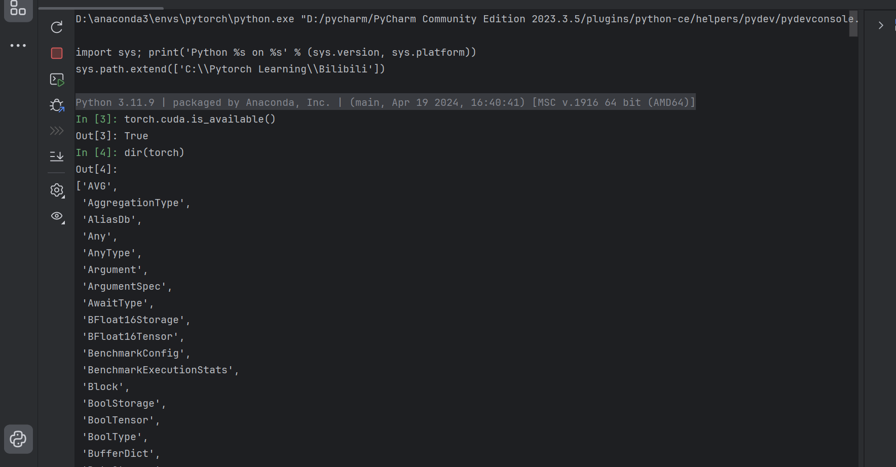
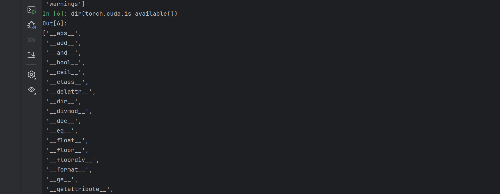
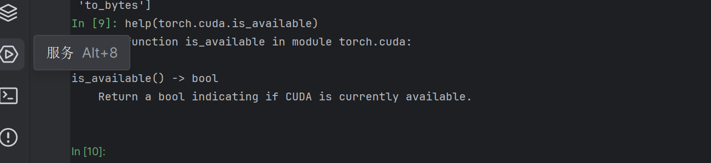

# Python学习中的两个重要函数
## dir()
可以不断打开package的中的工具箱

eg:

```
dir(pytorch)
dir(pytorch.3)
dir(pytirch.3.a)
```
当dir的输出结果含有左右下划线时，表明这已经被分割成函数

此时使用help查看函数使用方法

dir



dir到显示函数




## help()
类似一种查看说明书的使用方法




