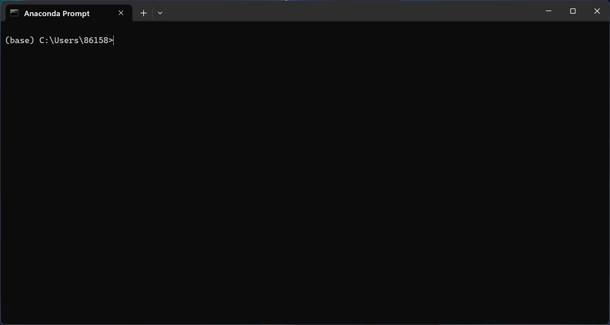
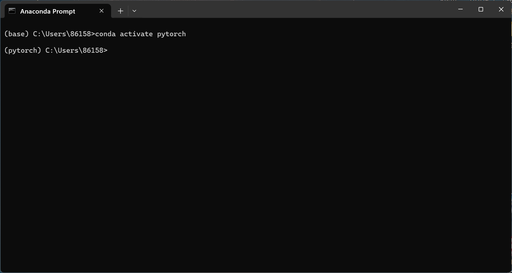
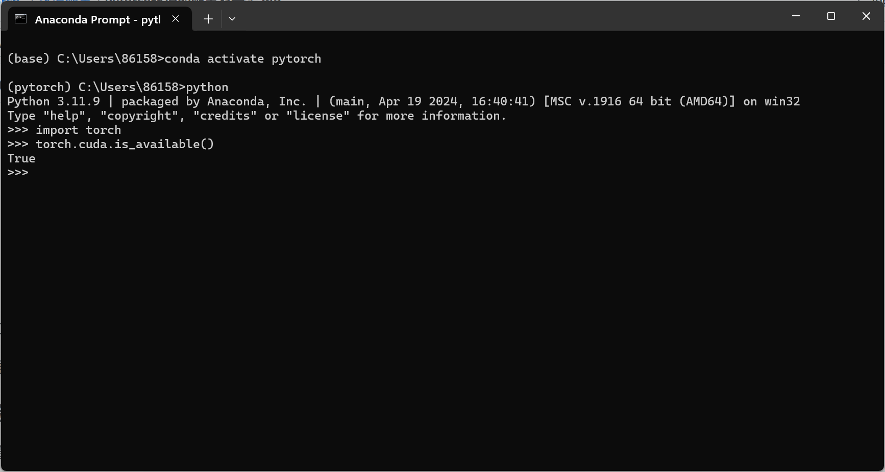

# Pytorch 环境配置及安装
## 安装anaconda
安装之前建议先注册一个账号，可以直接用github账号进行注册登录
安装anaconda可以包含很多对应的package，不需要再去单独下载某些库
要选择下载合适的版本

正常安装即可，选择默认设置，直接跳过Visual Studio这一步
**要记录安装的位置，增加环境变量的时候会更加方便**

### 检验是否安装成功
可以打开Anaconda Prompt即可
如图所示，有base即表示安装成功


## 环境管理
anconda可以满足配置多个环境
```
conda create -n 创建环境名 一些包
```

比如创建pytorch的的环境时可以用这样的语句

```
conda create -n pytorch python=3.6
```

可以通过语句进入该环境
```
conda activate 环境名
```
实现进入
如图，通过conda activate pytorch进入创建好的环境


通过语句pip list可以查看该环境下的包

## pytorch的安装
- 推荐选择稳定版本，Stable
- 选择对应版本
- 选择Package，Windows推荐conda，Linux推荐选择pip
- 选择合适的python版本
- CUDA，首先要知道显卡型号，Navida显卡在网上选择合适的版本
- 复制对应的运行指令
- 在conda终端，且是自己创建的pytorch环境下执行该命令即可

如图：

再使用pip list查看是否安装成功
### 检验自配环境下的pytorch
通过如下指令操作
```
import pytorch
torch.cuda.is_available()
```

若配置成功，则运行结果是True


