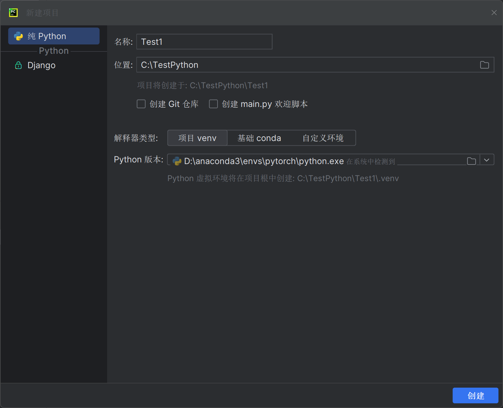
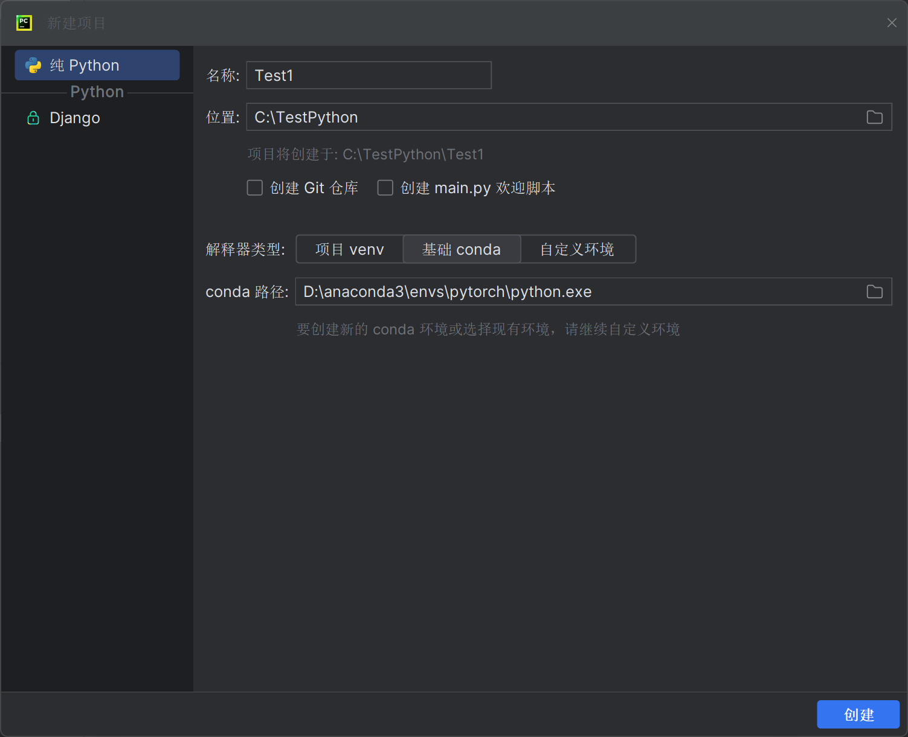
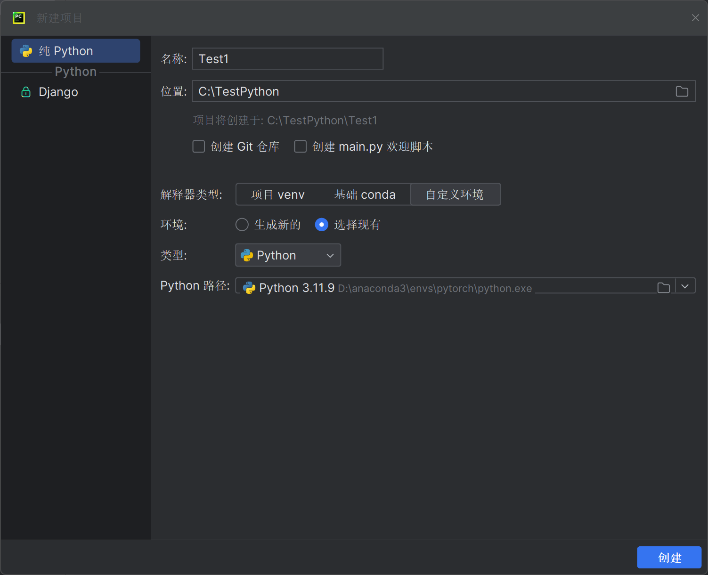

# 编译器选择，安装，配置
## Pycharm
进入官网直接下载即可，选择免费的社区版即可，可以满足绝大部分要求

选择对应的选项即可，有的可勾选可不勾选

**create Association处勾选即可**

具体安装pycharm的教程可以参考如下网址：
[如何安装pycharm](https://blog.csdn.net/Z987421/article/details/131422753)

### 环境配置
首先进入pycharm进行语言和主题等设置

创建项目所在的文件夹
- 确定项目所在位置
- 保险起见，解释器类型中的所有解释器选择**anconda目录中envs下pytorch的python.exe**即可
- 创建项目
- 测试环境是否配置成功
如图所示:




### 检验是否配置成功
在python控制台或建立一个py文件进行测试，输入代码：

```
import torch
print(torch.cuda.is_available())
```

### pycharm的一些技巧
python控制台可以显示变量属性和状态变化

可以尝试一些不熟悉的代码


## Jupyter
### 安装
若已经安装了anaconda，则无需安装jupyter notebook

打开当前anaconda终端，默认是base环境

输入conda list可以查看到相关package，但是自己创建的pytorch环境下是没有的

因此有两种选择

1.在base环境下下载pytorch

2.在pytorch环境下载jupyter


进入pytorch环境下用语句**conda install nb_conda**安装

安装完成后开始测试
### 测试
创建文件
输入语句：
```
import torch
torch.cuda.is_available()
```

shift+enter表示进入下一行并执行上一行


